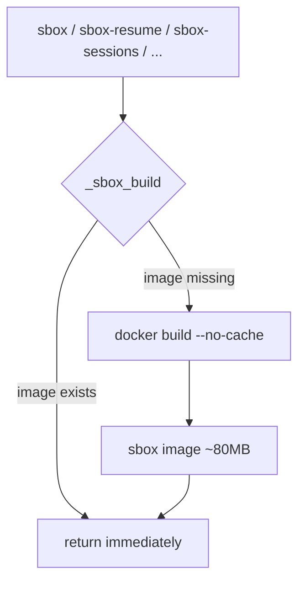
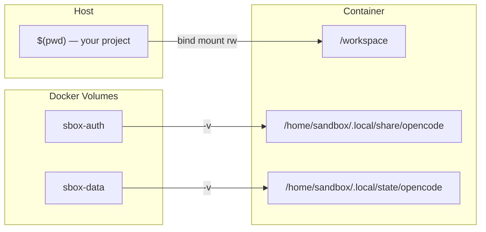
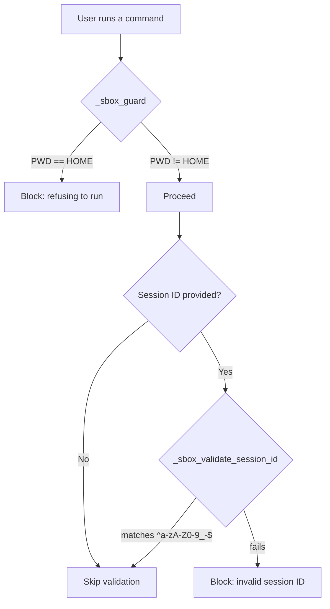
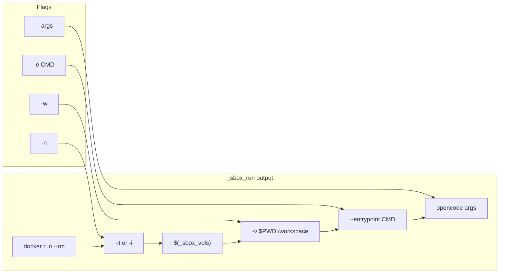
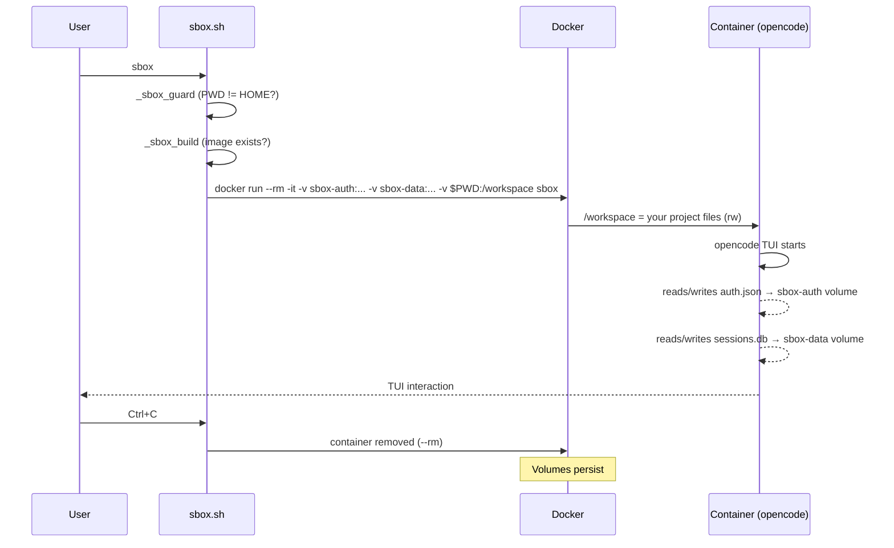

# System Architecture

## Overview

sbox wraps [opencode](https://opencode.ai) — an AI coding agent — in a Docker container. Your project directory is bind-mounted in; the agent sees nothing else on your machine. Credentials, sessions, and all agent state live in Docker volumes that never touch your host filesystem.

The system is built on **four capabilities** that every feature depends on:

1. **Image lifecycle** — lazy-build a pinned Alpine image on first use
2. **Volume management** — two named volumes separating credentials from session data
3. **Security guards** — prevent accidental host exposure and injection attacks
4. **Container runner** — a unified `docker run` assembler used by every command

---

## The Four System Capabilities

### 1. Image Lifecycle

The image is built lazily — only on the first command that needs it. Subsequent commands skip the build entirely. `sbox-rebuild` explicitly removes the image and rebuilds (for picking up new opencode versions).

The Dockerfile pins everything:
- `alpine:3.21` (not `latest`)
- `OPENCODE_VERSION=1.14.39` via build arg
- All packages via `apk add --no-cache`

The opencode binary is a native Bun-compiled executable — no Node.js runtime is needed inside the container.

### 2. Volume Management

Two named Docker volumes keep agent data off your host:

| Volume | Container path | Contents | Managed by |
|---|---|---|---|
| `sbox-auth` | `/home/sandbox/.local/share/opencode` | `auth.json` (provider credentials) | `sbox-reset-auth` |
| `sbox-data` | `/home/sandbox/.local/state/opencode` | SQLite DB (sessions, todos, stats) | `sbox-reset-all` |

**Why two volumes?** Credentials and session data have different lifecycles. You might want to wipe auth (switch provider) without losing session history, or wipe everything for a clean start. A single volume would force an all-or-nothing reset.

### 3. Security Guards

Three layers of protection:

- **HOME guard** (`_sbox_guard`) — refuses to run from `$HOME` because bind-mounting `$HOME` would expose your entire home directory to the agent
- **Session ID validation** (`_sbox_validate_session_id`) — all commands accepting session IDs (`sbox-todos`, `sbox-delete`, `sbox-export`) validate them as `^[a-zA-Z0-9_-]+$` to prevent SQL injection via `sbox-db`
- **Container hardening** — the container runs as user `sandbox` (uid 1000), not root; no `--privileged` flag; no extra capabilities; no host credentials (no GitHub tokens, SSH keys, or dotfiles are passed in)

### 4. Container Runner

Every command funnels through `_sbox_run`, which assembles `docker run` calls consistently:

| Flag | Effect | Used by |
|---|---|---|
| `-w` | Adds `-v $PWD:/workspace` (bind mount project) | `sbox`, `sbox-resume` |
| `-n` | Uses `-i` instead of `-it` (no TTY, for piped output) | query commands |
| `-e CMD` | Sets `--entrypoint CMD` (override `opencode`) | `sbox-todos` (uses `sqlite3`), `sbox-db` |
| `--` | Passes remaining args to opencode | all commands |

This abstraction eliminates the duplication of assembling `docker run` flags across 12 commands.

---

## Data Flow

Complete picture of what enters and leaves the container:

Key properties:
- **Your project files** are bind-mounted read/write — the agent can edit them, and you see changes immediately on your host
- **Credentials** go into `sbox-auth` volume — never written to your host filesystem
- **Session data** goes into `sbox-data` volume — never written to your host filesystem
- **`AGENTS.md` and `opencode.json`** are written into your project by opencode itself — these are the only agent artifacts that land on your host, and you should commit them
- The container is removed on exit (`--rm`), but volumes persist between runs

---

## Feature-to-System Mapping

Every command is a composition of system capabilities:

| Command | Image lifecycle | Volume mount | HOME guard | Session validation | `_sbox_run` flags |
|---|:---:|:---:|:---:|:---:|---|
| `sbox` | `_sbox_build` | both | `_sbox_guard` | — | `-w` |
| `sbox-resume` | `_sbox_build` | both | `_sbox_guard` | — | `-w` |
| `sbox-sessions` | `_sbox_build` | both | — | — | (none) |
| `sbox-todos` | `_sbox_build` | both | — | optional | (raw docker) |
| `sbox-stats` | `_sbox_build` | both | — | — | (none) |
| `sbox-export` | `_sbox_build` | both | — | if provided | (none) |
| `sbox-db` | `_sbox_build` | both | — | — | (none) |
| `sbox-delete` | `_sbox_build` | both | — | required | (none) |
| `sbox-rebuild` | `rmi` + `_sbox_build` | — | — | — | — |
| `sbox-reset-auth` | — | rm `sbox-auth` | — | — | — |
| `sbox-reset-all` | — | rm both | — | — | — |

---

## Design Decisions

### Why two volumes instead of one?

Credentials and session data have independent lifecycles. `sbox-reset-auth` wipes only the `sbox-auth` volume so you can re-authenticate (switch providers, rotate keys) without losing session history. `sbox-reset-all` wipes both. A single volume would force an all-or-nothing approach.

### Why a non-root `sandbox` user?

The container runs as uid 1000 (`sandbox`), not root. If the agent attempts privilege escalation inside the container, it starts from an unprivileged user. Combined with Docker's default capability restrictions (no `--privileged`, no extra caps), this provides defense in depth.

### Why `--no-cache` on every build?

Reproducibility. Without `--no-cache`, Docker may use cached layers that include outdated packages. Since the image is only built once (lazy) and rebuilt explicitly via `sbox-rebuild`, the build-time cost is negligible compared to the guarantee of a fresh image.

### Why bind-mount instead of copying the project?

Live editing. The agent reads and writes files in `/workspace`, and those changes appear immediately on your host. A copy-based approach would require syncing files back, adding complexity and race conditions.

### Why a native binary instead of Node.js?

The original MVP used `node:22-alpine` and `npm install -g opencode-ai`. Switching to the official install script (native Bun-compiled binary) removed the entire Node.js runtime from the image, reducing it from ~400MB to ~80MB. Fewer packages means a smaller attack surface.

### Why lazy image building?

First-run experience. Running `sbox` from any directory should "just work" — no separate build step. The ~30s build happens once, and every subsequent command is instant. Commands that don't need the container (`sbox-reset-auth`, `sbox-reset-all`) skip the build entirely.

### Why source shell functions instead of a binary?

Zero installation. `source sbox.sh` in your shell config gives you all commands as shell functions. No PATH manipulation, no symlinks, no build step. The functions call `docker run` directly, so they work in any bash or zsh environment with Docker installed.
