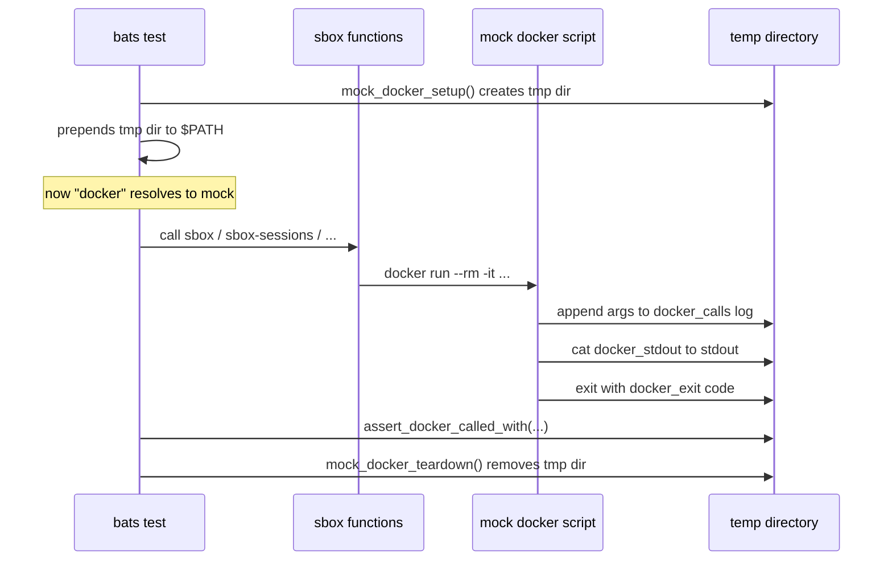

# Testing Guide

Tests use [bats-core](https://github.com/bats-core/bats-core). Unit tests mock the `docker` command — no Docker daemon required. Integration tests run real Docker builds and containers.

---

## Setup

```bash
test/setup.sh
```

This clones bats-core into `test/bats-core/` (git-ignored). One-time operation.

### Cleanup

```bash
# Remove test dependencies and temp files
test/cleanup.sh

# Also remove Docker artifacts (image + volumes) from integration tests
test/cleanup.sh --docker
```

---

## Running Tests

```bash
# Everything
test/bats-core/bin/bats test/

# Unit tests only (no Docker daemon needed)
test/bats-core/bin/bats test/unit/

# Integration tests only (requires Docker running)
test/bats-core/bin/bats test/integration/

# Single file
test/bats-core/bin/bats test/unit/helpers.bats
test/bats-core/bin/bats test/unit/launch.bats
test/bats-core/bin/bats test/unit/query.bats
test/bats-core/bin/bats test/unit/manage.bats
test/bats-core/bin/bats test/integration/dockerfile.bats
test/bats-core/bin/bats test/integration/runtime.bats
```

---

## Test Organization

```
test/
  helpers/
    mocks.bash            Mock framework — fakes the docker command
  unit/
    helpers.bats          _sbox_build, _sbox_vols, _sbox_guard (18 tests)
    launch.bats           sbox, sbox-resume (12 tests)
    query.bats            sbox-sessions, sbox-todos, sbox-stats, sbox-export, sbox-db (13 tests)
    manage.bats           sbox-delete, sbox-rebuild, sbox-reset-*, sbox-help (15 tests)
  integration/
    dockerfile.bats       Image build, tool availability, user/permissions (13 tests)
    runtime.bats          Volume mounts, bind mounts, filesystem isolation (6 tests)
```

---

## Mock Framework API

Defined in `test/helpers/mocks.bash`. The framework replaces the `docker` command with a shell script that logs calls and returns configurable output.

### How it works



The mock creates a temporary directory containing:
- `docker` — executable script that logs calls and returns configured output
- `docker_calls` — log of all arguments passed to each `docker` invocation (one line per call)
- `docker_exit` — exit code to return (default `0`)
- `docker_stdout` — stdout to print (default empty)
- `docker_state` — internal state file (used by behavior presets)

### Setup and Teardown

Every test file uses this pattern:

```bash
setup() {
    load '../helpers/mocks'
    mock_docker_setup
    PATH="$_MOCK_DIR:$PATH"
    load_functions
}

teardown() {
    mock_docker_teardown
}
```

#### `mock_docker_setup`

Creates the temp directory and mock `docker` script. Resets all state (exit code = 0, stdout = empty, empty call log).

**Must be called before `load_functions`** because `load_functions` sources `sbox.sh`, which defines functions that will call `docker`.

#### `mock_docker_teardown`

Removes the entire temp directory. **Always call this in `teardown`** to prevent temp dir leaks.

#### `load_functions`

Sources `sbox.sh` from the repo root. This loads all modules (config, helpers, validate, commands) into the test's shell environment. The mocked `docker` is already on `$PATH`, so all `_sbox_build` / `_sbox_run` calls hit the mock.

### Behavior Presets

#### `mock_docker_inspect_ok`

Configures the mock so `docker image inspect` succeeds (exit 0). This makes `_sbox_build` think the image already exists and skip the build.

**Use when:** testing commands that assume the image is already built (most tests).

```bash
mock_docker_inspect_ok
```

#### `mock_docker_inspect_fail`

Configures the mock so `docker image inspect` fails (exit 1). This makes `_sbox_build` attempt a build.

**Use when:** testing the build behavior itself, or the `sbox-rebuild` command.

```bash
mock_docker_inspect_fail
```

Both presets also configure behaviors for `docker rmi` and `docker volume rm` to succeed automatically.

### State Control

#### `mock_docker_set_exit <code>`

Set the exit code the mock returns. Default is `0`.

```bash
mock_docker_set_exit 1  # all docker calls will exit 1
```

#### `mock_docker_set_stdout <text>`

Set the text the mock prints to stdout. Default is empty.

```bash
mock_docker_set_stdout "session-id-123"  # docker calls will print this
```

### Assertions

#### `assert_docker_called_with <expected>`

Fails the test if no `docker` call contained `expected` as a substring. Prints the actual calls on failure.

```bash
assert_docker_called_with "--rm"
assert_docker_called_with "/tmp/project:/workspace"
```

#### `assert_docker_not_called_with <expected>`

Fails the test if any `docker` call contained `expected` as a substring. Prints the actual calls on failure.

```bash
assert_docker_not_called_with "volume"  # verify no volume rm happened
```

### Inspection

#### `mock_docker_calls`

Returns the full log of all `docker` invocations (one line per call).

```bash
local calls
calls="$(mock_docker_calls)"
```

#### `mock_docker_last_call`

Returns the last `docker` invocation only.

```bash
local last
last="$(mock_docker_last_call)"
```

#### `mock_docker_call_count`

Returns the number of `docker` invocations as a number (whitespace-trimmed).

```bash
[ "$(mock_docker_call_count)" -eq 0 ]  # no docker calls were made
```

---

## Writing a New Test

### 1. Choose the right file

| Testing | File |
|---|---|
| `_sbox_build`, `_sbox_vols`, `_sbox_guard` | `test/unit/helpers.bats` |
| `sbox`, `sbox-resume` | `test/unit/launch.bats` |
| `sbox-sessions`, `sbox-todos`, `sbox-stats`, `sbox-export`, `sbox-db` | `test/unit/query.bats` |
| `sbox-delete`, `sbox-rebuild`, `sbox-reset-*`, `sbox-help` | `test/unit/manage.bats` |
| Image contents, tools, user | `test/integration/dockerfile.bats` |
| Volume mounts, bind mounts, isolation | `test/integration/runtime.bats` |

### 2. Unit test template

```bash
#!/usr/bin/env bats

setup() {
    load '../helpers/mocks'
    mock_docker_setup
    mock_docker_inspect_ok        # or mock_docker_inspect_fail
    PATH="$_MOCK_DIR:$PATH"
    load_functions
}

teardown() {
    mock_docker_teardown
}

@test "my new command does something" {
    PWD="/tmp/test-project" HOME="/tmp/test-home" run sbox-my-command
    [ "$status" -eq 0 ]
    assert_docker_called_with "expected-arg"
}
```

Key patterns:
- Set `PWD` and `HOME` when testing commands that use `_sbox_guard`
- Use `run` to capture output and exit code
- Use `assert_docker_called_with` to verify docker arguments
- Use `[ "$status" -eq N ]` to verify exit codes
- Use `echo "$output" | grep -q "text"` to verify output

### 3. Integration test template

```bash
#!/usr/bin/env bats

setup() {
    REPO_ROOT="$(cd "$(dirname "$BATS_TEST_FILENAME")/../.." && pwd)"
    IMAGE="sbox"
}

@test "my integration scenario" {
    run docker run --rm --entrypoint sh "$IMAGE" -c "command -v tool"
    [ "$status" -eq 0 ]
}
```

Integration tests run real Docker commands. They require a running Docker daemon and a pre-built image.

---

## Test Counts

| Suite | File | Tests |
|---|---|---|
| Unit | `helpers.bats` | 14 |
| Unit | `launch.bats` | 11 |
| Unit | `query.bats` | 14 |
| Unit | `manage.bats` | 19 |
| Integration | `dockerfile.bats` | 15 |
| Integration | `runtime.bats` | 7 |
| **Total** | | **80** |
